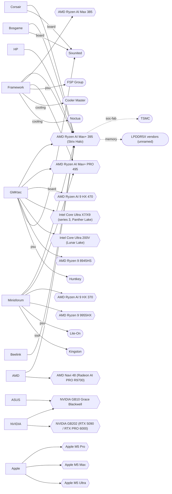

# Engineering index: mini PCs and local-AI compute

Generated by `node scripts/compute/build.mjs` from `data/compute/*.json`. Do not edit by hand; edit the records and rerun.
Data hash `f20e609e8e0d0a9d`. Research date 2026-10-05. Buyer region assumed NL/EU (OPEN). 95 nodes, 299 edges.

## How to read the evidence tags

| Tag | Meaning |
|---|---|
| documented | A record cites an opened source that states it (manufacturer page, teardown, review, or a community wiki where named) |
| inferred | Our reasoning from documented facts |
| rumor | Reported, not confirmed by an opened primary source |
| unsourced | A graph edge whose record cites no source |
| page-read price | Read from a merchant, manufacturer or price-comparison listing page whose host matches the named merchant, opened on the date shown; the price record names that page |
| listing price | The lowest price on a comparison site that does not name the selling shop (for example Tweakers Pricewatch); checked like a page-read price but never used as a headline |
| reported / forum / derived / snippet price | Not shown as a headline price: second-hand, forum post, arithmetic, or search-result text |
| community-report claim | A community wiki, forum or aggregate; it is attributed, not treated as an independent measurement |

## Supply lineage

Solid arrows are documented. Dashed arrows are inferred or rumor. Brand-level arrows aggregate machine records.

## Brands: how each one builds and sells

### GMKtec (maker)

Sells the Sixunited AXB35-02 Strix Halo board (a community wiki's attribution) in its own chassis as the EVO-X2, and a larger OCuLink chassis with the same SoC as the EVO-X3. EU list prices seen: EVO-X2 64GB EUR 1,999.99 and EVO-X3 128GB EUR 3,499.99. No like-for-like official EU EVO-X2 128GB price was extracted.

- Platform: Sixunited. Own board design: false.
- memory: Soldered LPDDR5X on every Strix Halo and Intel Lunar/Panther model; SO-DIMM only on K11, K8 Plus and M-series [inferred]
- power: External Huntkey PSU on the EVO-X2; 8-14 W idle, 147-160 W under 70B load [documented]
- network: Single 2.5GbE on EVO-X2; OCuLink only on EVO-X3 [documented]
- acoustics: 41-43 dBA under AI load at the STH test position [documented]
- EU terms: Return window and restocking fee read shorter than the EU 14-day withdrawal right; needs a legal check. Shipping policy summary mentions declaring a lower commodity value: treat as a compliance risk, never as a method.
- Strengths: Lowest official EU list price for a complete 64GB Strix Halo machine seen (EUR 1,999.99); Large model range incl. serviceable K11
- Weak points: Shares a board platform with several other brands per a community wiki, so the hardware itself is not distinctive; Official EU 128GB EVO-X2 price not extracted; independent retail EUR 3,999-4,450 incl. VAT (Austria, Estonia); Short EU return window, restocking fee
- Affiliate: Awin, not disclosed on page, cookie not found [partial]

### Minisforum (maker)

Positions the MS-S1 MAX as a workstation: internal 320 W PSU, 2x10GbE, PCIe x16 slot wired x4, rack and two-unit cluster marketing. The board appears to be its own design (inferred; the board fab was not identified). Also sells SO-DIMM machines (AI X1 Pro up to 96GB) and announced a Strix Halo mini-ITX board (BD395i MAX).

- Platform: own design. Own board design: not established.
- power: Internal Lite-On 320 W PSU in the MS-S1 MAX; about 10 W idle in Windows, 200-220 W peak [documented]
- network: 2x10GbE on MS-S1 MAX [documented]
- expansion: PCIe 4.0 x16 slot that is x4 electrically; no OCuLink on MS-S1 MAX; OCuLink on AI X1 Pro [documented]
- memory: Soldered 64/128/192GB on Strix Halo models; SO-DIMM on AI X1 Pro [documented]
- EU terms: UK page read: 24 months standard (36 months promotion ended 2026-07-31), 30-day returns, customer pays return shipping. EU/NL policy page not opened. Store sells a EUR 30 'Duty Free Shipping Service' and 'Tariff Insurance' as products: customs handling unverified.
- Strengths: Own board design and best-documented workstation feature set; Wholesale route from 10 units with 3-year warranty
- Weak points: EU list is high (EUR 3,999 sale / 4,999 regular for 128GB); BIOS issues reported on AI X1 Pro (one owner) and a loud idle on early MS-S1 MAX fixed by BIOS v1.03 (Notebookcheck, via search digest); No independent EU merchant price verified
- Affiliate: Awin, 2% (ex VAT and postage on Webgains DE); 1-8% claimed by directories, cookie 30 [verified]

### Framework (maker)

Standard mini-ITX mainboard sold separately and as a DIY or prebuilt Desktop, with named component partners and public price explanations. Raised prices during the 2026 DRAM shortage and states it will cut when the market calms.

- Platform: own design. Own board design: not established.
- power: Semi-custom FSP 400 W Flex ATX PSU [documented]
- cooling: Cooler Master and Noctua co-developed thermal system [documented]
- platform: AMD-supplied Strix Halo platform; 192GB Max+ PRO 495 variant ships Nov 2026 [documented]
- EU terms: Support and warranty terms not read.
- Strengths: Named suppliers (FSP, Cooler Master, Noctua), serviceable design, EU store with VAT-inclusive prices; Mainboard sold alone: the closest thing to a build-your-own Strix Halo
- Weak points: 128GB mainboard alone EUR 3,539 incl. VAT, about EUR 1,100 above a complete Bosgame M5 128GB seen in June; Out of stock on fetch day for 32/64/128GB DIY
- Affiliate: Impact, 1-5% (directory claim), higher private payouts possible, cookie not found [partial]

### Bosgame (maker)

Sells the Sixunited-platform M5 at the lowest complete-system price found: EUR 2,439.95 for 128GB/2TB on 24 June 2026 (cut from EUR 2,875.95). One June observation only; bosgamepc.com blocked live fetches.

- Platform: Sixunited. Own board design: false.
- platform: Sixunited platform per community wiki [documented]
- EU terms: Not read.
- Strengths: Cheapest credible complete 128GB machine in the data
- Weak points: Stuck power button and limited BIOS updates reported in the community wiki; Price not verified live

### Beelink (maker)

GTR9 Pro uses a board the community wiki treats as distinct from Sixunited, with early stability problems in owner threads. Offers ODM/OEM services and wholesale.

- Platform: own or unidentified (not established). Own board design: not established.
- network: 2x10GbE and USB4 on GTR9 Pro [documented]
- EU terms: Not read.
- Strengths: Offers ODM and OEM route (wholesale@bee-link.com)
- Weak points: USD price on DE page with 35-day pre-order; stability reports are forum-level evidence
- Affiliate: Impact, 5-10% incl. VAT (directory claim), cookie 30 (directory claim) [partial]

### HP (oem)

Z2 Mini G1a is a Strix Halo workstation sold through business resellers: EUR 3,890.15 incl. VAT for 128GB/1TB at a Dutch reseller, ships when available; the 2x1TB SKU on the same listing is EUR 7,025.26.

- Platform: n/a. Own board design: not established.
- EU terms: Not read.
- Strengths: Cheapest verified in-NL 128GB listing with VAT stated
- Weak points: B2B channel, SKU ambiguity, OS on SKU not stated

### Corsair (brand-on-platform)

AI Workstation 300 is on the Sixunited platform per the community wiki. List price rose from USD 1,999.99 at launch to 2,699.99 from, max USD 3,399.99.

- Platform: Sixunited. Own board design: false.
- EU terms: EU availability and price not verified.
- Strengths: Established brand and retail presence
- Weak points: EU price not verified
- Affiliate: Impact, Directory claims 0.8-2.4% and $8 on systems, cookie 30 (directory claim) [partial]

### AMD (silicon-vendor)

Supplies the Strix Halo silicon and sells its own Ryzen AI Halo reference mini PC (launched 10 July 2026 in the US; about EUR 4,100 in Germany per Notebookcheck, approximate). A Medusa Halo successor with LPDDR6 is a rumor for 2027-28.

- Platform: n/a. Own board design: not established.
- EU terms: n/a

### NVIDIA (silicon-vendor)

DGX Spark (GB10) is Linux-only (DGX OS) with CUDA; USD 3,999 at launch, USD 4,699 after a February 2026 rise. OEM GB10 boxes (ASUS, Gigabyte, Dell, Lenovo, MSI, HP, Acer) list USD 5,400-8,200 with stock-outs.

- Platform: n/a. Own board design: not established.
- software: DGX OS (Linux) only [documented]
- EU terms: No EU list price verified.
- Strengths: Fast prompt processing (pp about 1956 t/s on gpt-oss-120b)
- Weak points: Not Windows; Price and stock volatility

### ASUS (oem)

Ascent GX10 is an ASUS GB10 box: USD 6,999 on the ASUS US store (forum report) and EUR 3,680 ex VAT in one forum post. Neither is a verified EU merchant price.

- Platform: NVIDIA GB10 reference platform. Own board design: not established.
- EU terms: n/a
- Weak points: Evidence is forum-level

### Apple (vertical)

Vertically integrated unified memory: Mac Studio M5 Max 460/614 GB/s (to 128GB), M5 Ultra 1.2 TB/s (96GB base, 512GB max), Mac mini M5 Pro 307 GB/s (64GB max). macOS only. Raised Mac mini prices by EUR 300-350 over the M4 generation.

- Platform: own design. Own board design: true.
- memory: Unified memory; GPU wired limit adjustable via iogpu.wired_limit_mb [documented]
- EU terms: Not read.
- Strengths: Memory bandwidth 1.2x to 4.7x Strix Halo's 256 GB/s theoretical; Documented 512GB option
- Weak points: No Windows; Apple NL pages show no prices (prices taken from iCulture / EveryMac); Apple affiliate covers digital content only, not Mac hardware
- Affiliate: Partnerize, 7% TV/movies/books; one-time payment on memberships; no hardware listed, cookie 30 [verified]

## Machines with a page-read price

| Machine | Memory | Bandwidth | Cheapest page-read EUR | EUR per GB | Other reported price (not page-read) | Measured local-LLM (as reported) |
|---|---|---|---|---|---|---|
| EVO-X2 128GB/2TB (Ryzen AI Max+ 395) | 128 GB LPDDR5X | 256 GB/s | EUR 3,999 (incl. VAT, galaxus.at via Geizhals.at, 2026-10-05) | 31 | EUR 4,319 (listing: Tweakers Pricewatch (lowest listed)) | Llama 3.3 70B Q6_K 3.7-3.8 t/s; Qwen3-32B dense 10.4-10.5 t/s |
| EVO-X2 64GB/1TB | 64 GB LPDDR5X | 256 GB/s | EUR 1,999.99 (tax not stated, de.gmktec.com, 2026-10-05) | 31 | EUR 2,139 (listing: Tweakers Pricewatch (lowest listed)) | none verified |
| EVO-X3 128GB/2TB or 4TB | 128 GB LPDDR5X | 256 GB/s | EUR 3,499.99 (tax not stated, de.gmktec.com, 2026-10-05) | 27 | none | none verified |
| EVO-X5 Pro 192GB (Ryzen AI Max+ PRO 495) | 192 GB LPDDR5X | 273 GB/s | none page-read | n/v | none | none verified |
| EVO-X1 Pro 64GB/1TB (Ryzen AI 9 HX 470) | 64 GB LPDDR5 | n/v | EUR 1,499.99 (tax not stated, de.gmktec.com, 2026-10-05) | 23 | none | none verified |
| EVO-T2 64GB (Core Ultra X7 358H / X9 388H) | 64 GB LPDDR5X | n/v | EUR 1,799.99 (tax not stated, de.gmktec.com, 2026-10-05) | 28 | none | none verified |
| NucBox K13 16GB (Core Ultra 7 256V) | 16 GB LPDDR5X on-package | n/v | EUR 579.99 (tax not stated, de.gmktec.com, 2026-10-05) | 36 | none | none verified |
| NucBox K17 / K17 Plus 32GB (Core Ultra 5 226V / 7 258V) | 32 GB LPDDR5X on-package | n/v | none page-read | n/v | none | none verified |
| NucBox K11 (Ryzen 9 8945HS), barebone / 32GB / 64GB variants | up to 64 GB, DDR5 SO-DIMM x2 (not included) | n/v | EUR 469.99 (tax not stated, de.gmktec.com, 2026-10-05) | n/v | none | none verified |
| MS-S1 MAX 128GB (Ryzen AI Max+ 395, 2TB SSD) | 128 GB LPDDR5X | 256 GB/s | EUR 3,999 sale (tax not stated, minisforumpc.eu, 2026-10-05) | 31 | USD 3,799 (reported: StarryHope citing MSRP) | qwen3.5 35B (MoE, ~24GB) 43.2 t/s; qwen3.5 122B Q4_K_M (81GB) 19.2 t/s |
| MS-S1 MAX 64GB (Local AI Pilot Edition) | 64 GB LPDDR5X | 256 GB/s | EUR 2,679 sale (tax not stated, minisforumpc.eu, 2026-10-05) | 42 | none | none verified |
| MS-S1 MAX-P495 (Ryzen AI Max+ Pro 495, 192GB) | 192 GB LPDDR5X | 273 GB/s | EUR 7,799 sale (tax not stated, minisforumpc.eu, 2026-10-05) | 41 | USD 7,399 (reported: Minisforum US per press) | none verified |
| BD395i MAX (mini-ITX board, Ryzen AI Max+ 395) | 128 GB LPDDR5X | 256 GB/s | none page-read | n/v | none | none verified |
| AI X1 Pro-370 (Ryzen AI 9 HX 370) | up to 96 GB, DDR5 SO-DIMM (not included) | n/v | none page-read | n/v | EUR 729 (snippet: minisforumpc.eu) | deepseek-r1-distill-qwen-14b 8.8 t/s |
| MS-A2 Workstation (Ryzen 9 9955HX) | n/v | n/v | none page-read | n/v | EUR 839 (snippet: minisforumpc.eu) | none verified |
| Desktop DIY Max+ 395 128GB | 128 GB LPDDR5X-8000 soldered | 256 GB/s | EUR 3,889 (tax not stated, Framework NL, 2026-10-05) | 30 | none | none verified |
| Desktop DIY Max+ 395 64GB | 64 GB LPDDR5X-8000 soldered | 256 GB/s | EUR 2,209 (tax not stated, Framework NL, 2026-10-05) | 35 | none | none verified |
| Desktop DIY Max 385 32GB | 32 GB LPDDR5X soldered | n/v | EUR 1,429 (tax not stated, Framework NL, 2026-10-05) | 45 | none | none verified |
| Desktop Max+ PRO 495 192GB | 192 GB LPDDR5X-8533 | 273 GB/s | none page-read | n/v | USD 6,799 (reported: Framework (per BornCity)) | none verified |
| Z2 Mini G1a Ryzen AI Max+ PRO 395 128GB/1TB | 128 GB LPDDR5X-8000 | 256 GB/s | EUR 3,890.15 (incl. VAT, Bechtle/ARP NL, 2026-10-05) | 30 | none | none verified |
| AI Workstation 300 (395, 128GB) | 128 GB LPDDR5X-8000 | 256 GB/s | none page-read | n/v | USD 2,699.99 (reported: Corsair) | none verified |
| Ryzen AI Halo mini PC | 128 GB LPDDR5X | 256 GB/s | none page-read | n/v | EUR 4,100 (reported: Germany (approx per Notebookcheck), incl. VAT) | GPT-OSS / Qwen variants AMD claims 4-14% faster than DGX Spark t/s [mfr] |
| GTR9 Pro | 128 GB LPDDR5X-8000 | 256 GB/s | none page-read | n/v | none | none verified |
| M5 AI Mini | 128 GB LPDDR5X-8000 | 256 GB/s | none page-read | n/v | none | none verified |
| DGX Spark Founders Edition | 128 GB LPDDR5x coherent unified | 273 GB/s | none page-read | n/v | USD 4,699 (forum: NVIDIA store (per forum and OpenClawDC)) | gpt-oss-120b MXFP4 tg32 ~60.6, pp2048 ~1956 t/s; gpt-oss-20b MXFP4 tg32 ~67 t/s |
| Ascent GX10 1TB | 128 GB LPDDR5x | 273 GB/s | none page-read | n/v | EUR 3,680 (forum: EU retailer (forum user)); USD 6,999 (forum: ASUS US store (per forum)) | none verified |
| Mac mini M5 Pro 64GB | 64 GB unified LPDDR | 307 GB/s | none page-read | n/v | EUR 3,119 (derived: Apple NL (derived: 2,019 base + 1,100 RAM upgrade, iCulture), incl. VAT) | none verified |
| Mac Studio M5 Max 18c/40c GPU 64GB | 64 GB unified | 614 GB/s | none page-read | n/v | EUR 3,689 (reported: Apple NL (EveryMac), incl. VAT) | none verified |
| Mac Studio M5 Ultra 30c/64c GPU 96GB | 96 GB unified | 1200 GB/s | none page-read | n/v | EUR 6,649 (reported: Apple NL (iCulture, EveryMac), incl. VAT) | none verified |
| Framework Desktop Mainboard, Ryzen AI Max 385, 32GB (board only) | 32 GB LPDDR5X | n/v | EUR 1,079 (incl. VAT, Framework NL, 2026-10-05) | 34 | none | none verified |
| Framework Desktop Mainboard, Ryzen AI Max+ 395, 64GB (board only) | 64 GB LPDDR5X | 256 GB/s | EUR 1,859 (incl. VAT, Framework NL, 2026-10-05) | 29 | none | none verified |
| Framework Desktop Mainboard, Ryzen AI Max+ 395, 128GB (board only) | 128 GB LPDDR5X | 256 GB/s | EUR 3,539 (incl. VAT, Framework NL, 2026-10-05) | 28 | none | none verified |

Price notes: `n/v` means not verified. A price on this page is a snapshot from the named merchant on the named date, never a current offer. Amazon prices are not stored. EUR per GB uses the cheapest page-read EUR price for the stated memory size; sale prices are marked. Variant and memory must agree or the record fails validation.

## Which workloads each machine fits on capacity alone

Capacity only: bandwidth, software support and thermals are separate (see the speed column above). Rules are in `workloads.json`.

| Machine | agent-node-10 | agent-node-20 | local-moe-30b-q4 | local-dense-70b-q4 | local-moe-120b |
|---|---|---|---|---|---|
| EVO-X2 128GB/2TB (Ryzen AI Max+ 395) | yes | yes | yes | yes | yes |
| EVO-X2 64GB/1TB | yes | yes | yes | no | no |
| EVO-X3 128GB/2TB or 4TB | yes | yes | yes | yes | yes |
| EVO-X5 Pro 192GB (Ryzen AI Max+ PRO 495) | yes | yes | yes | yes | yes |
| EVO-X1 Pro 64GB/1TB (Ryzen AI 9 HX 470) | yes | yes | yes | no | no |
| EVO-T2 64GB (Core Ultra X7 358H / X9 388H) | yes | yes | yes | no | no |
| NucBox K13 16GB (Core Ultra 7 256V) | no | no | no | no | no |
| NucBox K17 / K17 Plus 32GB (Core Ultra 5 226V / 7 258V) | yes | no | no | no | no |
| NucBox K11 (Ryzen 9 8945HS), barebone / 32GB / 64GB variants | n/v | n/v | n/v | n/v | n/v |
| MS-S1 MAX 128GB (Ryzen AI Max+ 395, 2TB SSD) | yes | yes | yes | yes | yes |
| MS-S1 MAX 64GB (Local AI Pilot Edition) | yes | yes | yes | no | no |
| MS-S1 MAX-P495 (Ryzen AI Max+ Pro 495, 192GB) | yes | yes | yes | yes | yes |
| BD395i MAX (mini-ITX board, Ryzen AI Max+ 395) | yes | yes | yes | yes | yes |
| AI X1 Pro-370 (Ryzen AI 9 HX 370) | n/v | n/v | n/v | n/v | n/v |
| MS-A2 Workstation (Ryzen 9 9955HX) | n/v | n/v | n/v | n/v | n/v |
| Desktop DIY Max+ 395 128GB | yes | yes | yes | yes | yes |
| Desktop DIY Max+ 395 64GB | yes | yes | yes | no | no |
| Desktop DIY Max 385 32GB | yes | no | no | no | no |
| Desktop Max+ PRO 495 192GB | yes | yes | yes | yes | yes |
| Z2 Mini G1a Ryzen AI Max+ PRO 395 128GB/1TB | yes | yes | yes | yes | yes |
| AI Workstation 300 (395, 128GB) | yes | yes | yes | yes | yes |
| Ryzen AI Halo mini PC | yes | yes | yes | yes | yes |
| GTR9 Pro | yes | yes | yes | yes | yes |
| M5 AI Mini | yes | yes | yes | yes | yes |
| DGX Spark Founders Edition | yes | yes | yes | yes | yes |
| Ascent GX10 1TB | yes | yes | yes | yes | yes |
| Mac mini M5 Pro 64GB | yes | yes | yes | no | no |
| Mac Studio M5 Max 18c/40c GPU 64GB | yes | yes | yes | no | no |
| Mac Studio M5 Ultra 30c/64c GPU 96GB | yes | yes | yes | yes | no |
| Framework Desktop Mainboard, Ryzen AI Max 385, 32GB (board only) | yes | no | no | no | no |
| Framework Desktop Mainboard, Ryzen AI Max+ 395, 64GB (board only) | yes | yes | yes | no | no |
| Framework Desktop Mainboard, Ryzen AI Max+ 395, 128GB (board only) | yes | yes | yes | yes | yes |

## Channels

- **GMKtec EU store (de.gmktec.com)** (brand-direct, EU): Ships mainly from Bremen; 2-year warranty; 7-day return; 15% restocking fee
- **GMKtec US store (gmktec.com)** (brand-direct, US): 1-year warranty; prices USD ex tax
- **Geizhals.at / Galaxus.at** (retailer, AT): EVO-X2 128GB/2TB EUR 3,999 incl. 19% Austrian VAT
- **datafox.ee** (retailer, EE): EVO-X2 128GB/2TB Win11 Pro EUR 4,450.20 incl. 24% Estonian VAT
- **Minisforum EU store (minisforumpc.eu)** (brand-direct, EU): Sale/regular price pairs; tax status not stated; customs handling unverified
- **Minisforum corporate/bulk programme** (wholesale, EU): Minimum 10 units, wholesale pricing unpublished, 3-year extended warranty, German warehouse
- **Framework NL store** (brand-direct, NL): VAT-inclusive prices; DIY boards out of stock on fetch day
- **Bosgame EU store** (brand-direct, EU): June 2026 EUR 2,439.95 observation only; site blocked live fetch
- **Beelink store** (brand-direct, EU/DE): USD price on DE locale; 35-day pre-order
- **Bechtle / ARP Netherlands** (b2b-reseller, NL): HP Z2 Mini G1a; ships when available
- **Apple NL store** (brand-direct, NL): Prices shown on iCulture / EveryMac, not on Apple's NL spec pages
- **Alibaba.com / AliExpress** (marketplace, CN to EU): One Strix Halo 128GB snippet USD 3,027-3,107 (MOQ 1): no price edge for one unit; custom branding MOQ 500-1,000 per snippet for generic mini PCs
- **refurbed.nl** (refurb, NL): Business mini PCs EUR 164-495 in the listings seen; 12-month warranty
- **Apple Refurbished NL** (refurb, NL): No Mac Studio listed on 2026-10-05
- **Marktplaats / eBay.nl / Tweakers V&A / Back Market NL** (used, NL/EU): Not retrieved (blocked): no NL listing counts

## Companion documents and open gaps

- [Company fundamentals](COMPANY-FUNDAMENTALS.md): legal entity, EU presence, terms as written, support, incidents
- [Reviews and owner reports](REVIEWS.md)
- [Verification log](VERIFICATION-LOG.md): what was unverified and where it stands now
- [Expansion paths](EXPANSION-PATHS.md): eGPU, clusters, racks, RAG
- [Founder buying guide](FOUNDER-BUYING-GUIDE.md) and [fleet blueprint](FLEET-BLUEPRINT.md)

Gaps in `data/compute/gaps.json`: 110 open, 15 partly closed, 2 closed (127 total).
