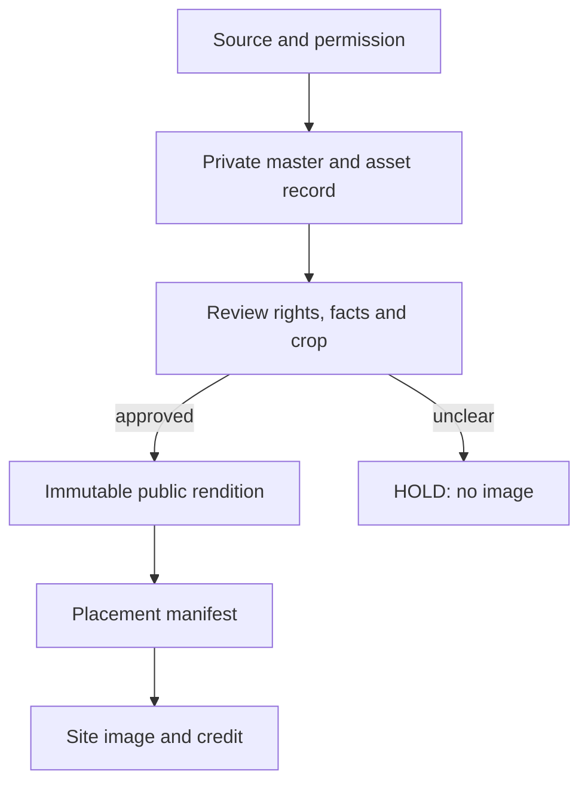

# Visual editorial handoff

Status: DRAFT implementation, 24 September 2026. This is the Starlight comparison slice on top of hardware research PR #21. It introduces no new image approval or affiliate partner.

## What a reader sees

The comparison route turns its existing `options` and evidence date into an accessible two-path decision graphic. The separate evidence photo slot resolves `starlight.compare.<slug>.evidence`; it is empty while no approved placement exists. A source citation remains in the evidence register. A shopping CTA, if later justified by an exact approved regional affiliate URL, belongs in its own disclosed commerce component, not on the photo or credit.

## Sourcing and movement

| Input | Place to obtain it | Required evidence before site use |
| --- | --- | --- |
| Device launch photo/video | Manufacturer newsroom media kit or explicit press permission | Named rights holder, allowed site/channel, territory, derivatives, required credit, expiry; newsroom appearance is not permission. |
| Real workflow image | Original team photo/screen recording | Owner/consent, product/build/region, EXIF/location removal, redaction, source date. |
| Merchant creative | Existing approved program's asset kit | Current partner rights, regional creative rules, issued destination separately from the image. |
| Decision diagram | Typed article evidence, rendered in CSS/SVG | Claim/source review, accessibility, exact labels, version and independent editorial review. |
| Video embed | Official player with embedding allowed or an owned approved video rendition | Player/usage terms, transcript/captions, thumbnail rights, privacy and consent. |

Never fetch another publisher's image library, treat screenshots of their article as reusable imagery, or invent a photo of a particular device. Keep official product marks exact and neutrally labelled unless a verified relationship authorizes another label.

1. Assign `asset_id`, immutable `version_id` and `rendition_id` before storage. Keep proof/rights privately with the shared media control plane or Drive review package, linked to that identity; do not commit private terms to Git.
2. Store the original in private Vercel Blob and an EXIF-stripped, approved web rendition in public Vercel Blob; use `{brand}/{asset_id}/{version_id}/{rendition_role}/{checksum-prefix}.{ext}`. Capture source, owner, checksum, dimensions, permission scope, credit and expiry.
3. Independent rights/fact and visual reviewers approve the exact rendition and intended site placement. A single publisher service writes the public-safe generated placement manifest in `data/media/approved-placements.json` with rights/approval receipt IDs, MIME, dates and site channel, then checks its Git head before committing. The site only reads that manifest; no Supabase lookup per image view. Receipt IDs are references, not private agreement text.
4. `ApprovedMediaFigure` serves that URL through Next Image optimization with alt, caption and credit. The resolver withholds absent, incomplete, off-domain, wrong-channel and expired entries. For time-limited licenses, the publisher must remove/supersede the placement before expiry and verify the cached page has been replaced. A code-level expiry check during build alone cannot guarantee removal from already deployed static HTML.
5. For short owned video, use an approved immutable MP4/WebM rendition and `<video controls>` with poster and text alternative. For longer licensed video, use the official permitted player with a click-to-load privacy option; do not store a third-party stream as an owned asset. No new streaming service is provisioned here.

The manifest is deliberately empty. No licensed device media, Blob bucket, storage credential, approval row or affiliate route was created by this change. Roll back a placement by restoring the previous approved manifest entry (or removing it) and rebuilding; keep the immutable prior binary and approval receipt for audit.

## Codex and existing connections

The OpenAI Developers plugin helps with OpenAI API access, docs and agents; this deterministic renderer uses no API key. Codex can continue drafting and reviewing through the existing GitHub connection and Vercel previews. Existing Content OS owns briefs, the general RSS monitor owns feed discovery, and the canonical affiliate ledger owns issued links. Add a scoped Responses API/Agents SDK adapter only after measured editorial work requires it and a paid budget is approved. Do not create another dashboard, crawler, scheduler or desktop worker for this slice.

The next blocked step is one image with explicit commercial web-use permission for a named product/region, plus an actual media-store/approval receipt. Until then the comparison graphic alone is ready for review, and no manufacturer photo should appear.
